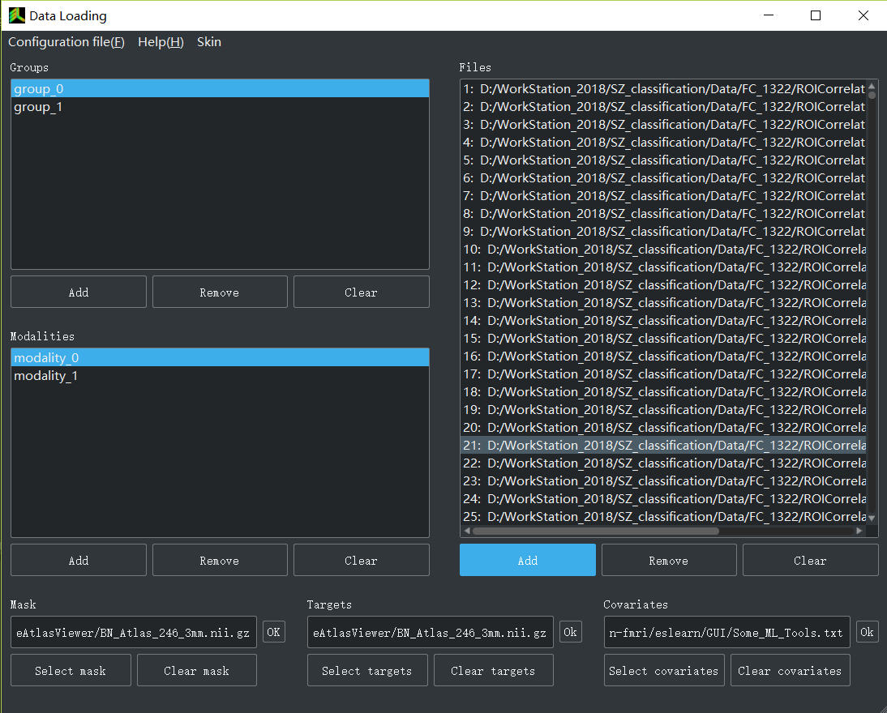
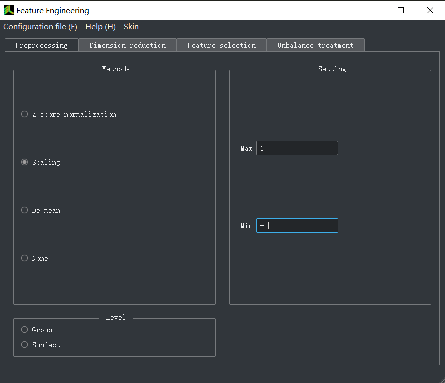
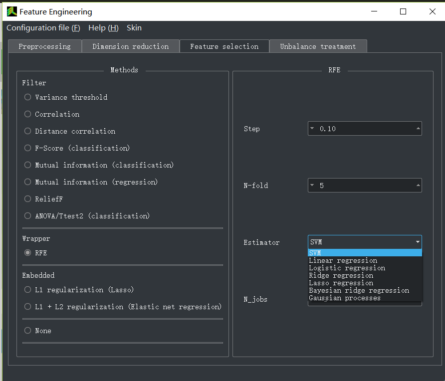
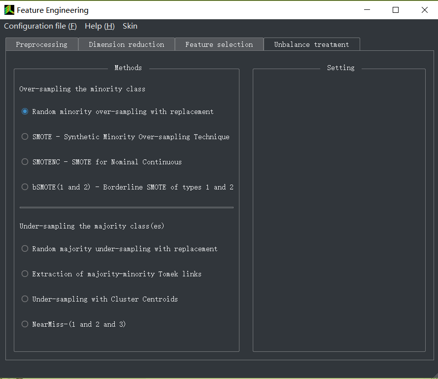
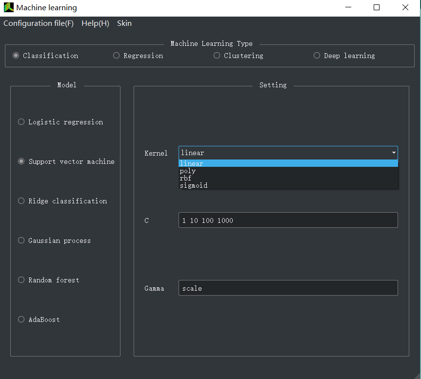
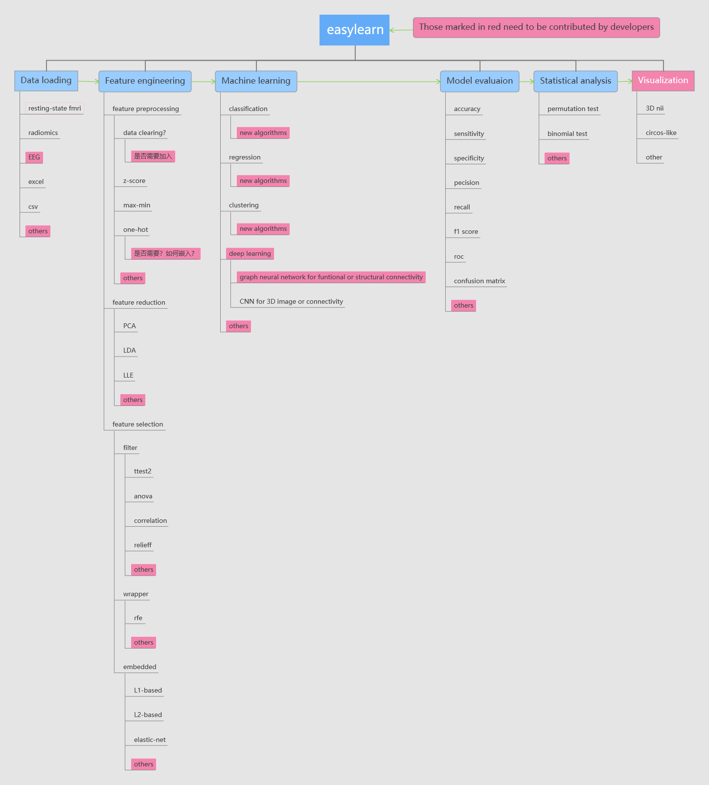
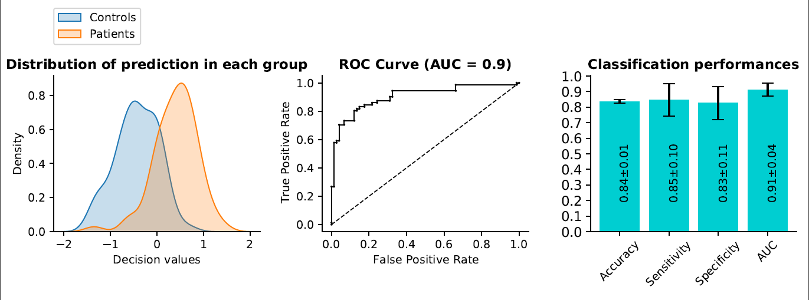
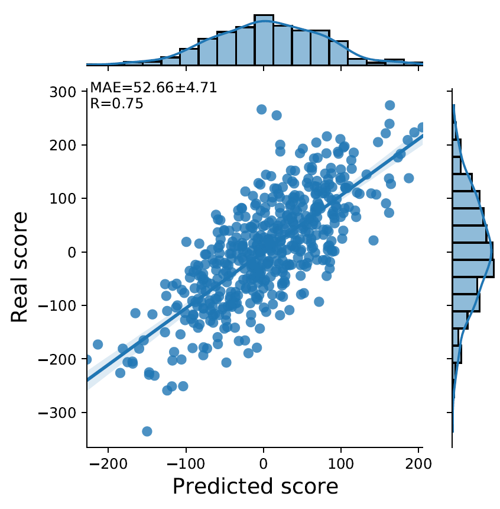

#   <font size=10>Make machine learning easy!</font>  
 
Easylearn is designed for machine learning mainly in resting-state fMRI, radiomics and other fields (such as EEG). Easylearn is built on top of scikit-learn, pytorch and other packages. Easylearn can assist doctors and researchers who have limited coding experience to easily realize machine learning, e.g., (MR/CT/PET/EEG)imaging-marker- or other biomarker-based disease diagnosis and prediction, treatment response prediction, disease subtyping, dimensional decoding for transdiagnostic psychiatric diseases or other diseases, disease mechanism exploration and etc.  

We focus on machine learning rather than data preprocessing. Many software, such as SPM, GRETNA, DPABI, REST, RESTPlus, CCS, FSL, Freesufer, nipy, nipype, nibabel, fmriprep and etc, can be used for data preprocessing.  

# Citing information:
If you think this software (or some function) is useful, citing the easylearn software in your paper or code would be greatly appreciated!
Citing link: https://github.com/easylearn-fmri/easylearn  

# Install  
```
pip install -U eslearn
```

# Usage
```
import eslearn as el
el.run()
```

# GUI preview
#### Main Interface
  
#### <center> Data loading Interface </center>
    
#### <center> Feature engineering Interface (feature preprocessing) </center>
   
#### <center> Feature engineering Interface (dimension reduction) </center>
   
#### <center> Feature engineering Interface (feature selection) </center>
   
#### <center> Feature engineering Interface (unbalance treatment) </center>
 
#### <center> Machine learning Interface </center>
 

# Core Dependencies 
The follows will be automatically install if you use "pip install -U easylearn" command    

- sklearn
- numpy
- pandas
- python-dateutil
- pytz
- scikit-learn
- scipy
- six
- nibabel
- imbalanced-learn
- skrebate
- matplotlib

# Development    
At present, the project is in the development stage. We hope you can join us!   
Any contributions you make will be appreciated and announced.   
Please refer to [developer link](https://github.com/easylearn-fmri/easylearn/tree/master/developer) for details.
# 
> Email: lichao19870617@gmail.com  
> Wechat: 13591648206  

# Initiators
##### Ke Xu
    kexu@vip.sina.com  
    Brain Function Research Section, The First Affiliated Hospital of China Medical University, Shenyang, Liaoning, PR China.  
    Department of Radiology, The First Affiliated Hospital of China Medical University.

##### Chao Li
    lichao19870617@gmail.com
    Brain Function Research Section, The First Affiliated Hospital of China Medical University, Shenyang, Liaoning, PR China.  
    
##### Mengshi Dong
    dongmengshi1990@163.com  
    Department of Radiology, The First Affiliated Hospital of China Medical University, Shenyang, Liaoning, PR China.   

# Supervisors/Consultants 
##### Yanqing Tang  
    yanqingtang@163.com  
    1 Brain Function Research Section, The First Affiliated Hospital of China Medical
    University, Shenyang, Liaoning, PR China.  
    2 Department of Psychiatry, The First Affiliated Hospital of China Medical University,
    Shenyang, Liaoning, PR China.        
    
##### Yong He  
    yong.he@bnu.edu.cn  
    1 National Key Laboratory of Cognitive Neuroscience and Learning, Beijing Normal University, Beijing 100875, China  
    2 Beijing Key Laboratory of Brain Imaging and Connectomics, Beijing Normal University, Beijing 100875, China  
    3 IDG/McGovern Institute for Brain Research, Beijing Normal University, Beijing 100875, China 

# Maintainers
##### Vacancy 1   
Contributors will first add to the [contributors_list.md](./developer/contributors_list.md). Once your contribution is important or more than or equal to 1/4 of the total code, we will add you as a maintainer.  

##### Vacancy 2  
Contributors will first add to the [contributors_list.md](./developer/contributors_list.md). Once your contribution is important or more than or equal to 1/4 of the total code, we will add you as a maintainer. 

# Contributors  
The current contributors are in [contributors_list.md](./developer/contributors_list.md). Once your contribution is important or more than or equal to 1/4 of the total code, we will add you as a maintainer. 

# Curent team members
The current team members are in [current_team_members.md](./developer/current_team_members.md). If you contributed your code, please add yourself to the contributor list.


# Results
If the program runs successfully, some results file will be generated under the working directory, as follows:
## <left> Classification performances </left>
  
<br> <br />
## <left>Regression performances</left>
  
## <left>Classfication weights (top 1%, BrainNet Viewer) </left>
 
<br> <br />

# New features in the next version
- Add evaluation method in the model_evaluation module for multiple-class classification
- Add user-defined cross-validation in the model_evaluation module.
- Add Decision Curve Analysis plot in the model_evaluation module.
- Support vertex data