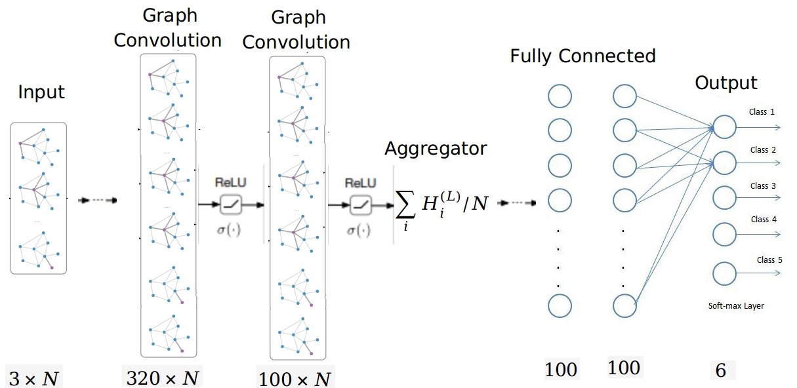

# GCNN Course Codes

This repository is the supplementary material for Graph Analysis Course in University of Rouen Normandy, at LITIS Lab. 

We are tackling with Multi-Graph graph classification problem. ENZYMES dataset consist of 600 graphs, needs to be classified into 6 group. The dataset is balanced. So we have 100 graph for each class. Although in original dataset, the nodes have 18 extra continious features in addition to three lenght one-hot coding node types, we do not use those continious features in that project in order to measure performance under using just node labels.

We appreciate previous works (GCN, kipf et all) and their codes, because we developed the codes upon their codes.
However that repository has crucial differences than GCN repository. First and foremost, within that repository, we showed how to use GCN, MLP, ChebNet (or any desired custom graph convolutional kernels) in inductive problems. Because base repository is for just transductive learning problem, where there is just one single graph and all test elements were given initially. 

Second, we added Depthwise Separable Schema to reduce the number of trainable parameter if there is more than one convolution kernel. 

We prepared two demo. One for classical Graph Convolution, which can be run by
```
python enzymes_GCNN.py
```
Another is demo for Depthwise Separable Graph Convolution, which can be run by
```
python enzymes_DSGCNN.py
```
All models use the same architecture, which has 3 neuron in inpput layer, 320 and 100 for graph convolution layers which followed by mean aggragetor layer, then 100 neurons fully connected layer and finally fully connected output layer which has 6 neurons as the same number of classes. We used RELU activation for all layer expect softmax in the last layer. Cross entropy is the used loss function. We applied dropout for all layer except last layer as well. We do not use any regularization in addition to cross entropy loss. Here is the architecture



