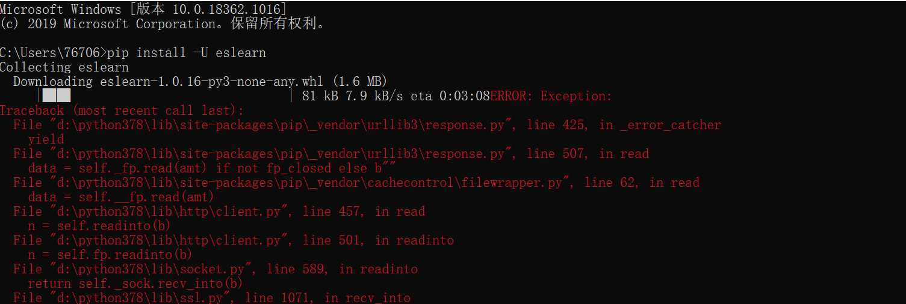
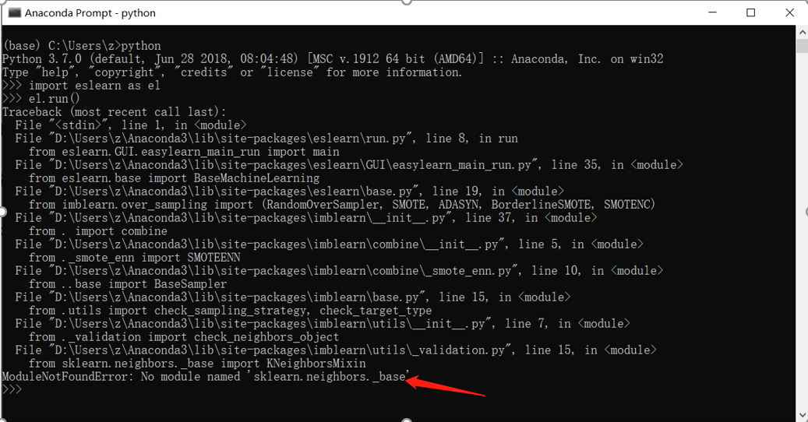
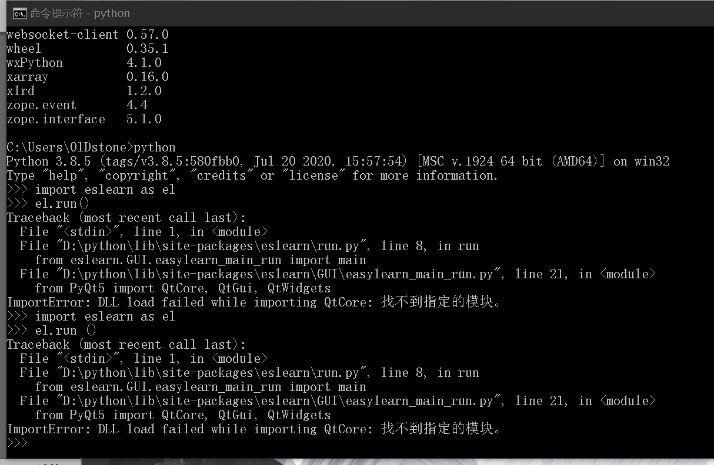
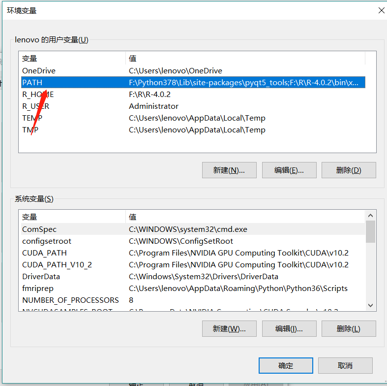

-----
# 问题1
导入模块时，提示numpy的问题，具体问题如下： 
RuntimeError: The current Numpy installation (‘D:\Develop\anaconda\lib\site-packages\numpy\init.py’) fails to pass a sanity check due to a bug in the windows runtime. See this issue for more information: 
#### 解决方法  
安装1.19.3版本的numpy(pip install numpy==1.19.3)。具体参考以下链接： https://www.weixiuzhan.cn/news/show-30424.html

#### 问题发现和提供解决方案者  
陈帅禹， 杭州师范大学

-----
# 问题2
如果您已经进入了python环境，当执行”pip install eslearn”时会报以下错误：
File ““, line 1
pip install eslearn
^
SyntaxError: invalid syntax 
#### 解决方法  
退出python环境(“exit()”)，到系统环境中去执行安装命令

-----
# 问题3
PyQt5版本问题
ERROR: Could not find a version that satisfies the requirment PyQt5==5.12 (from eslearn) ERROR: No matching distribution found for PyQt5==5.12 
#### 解决方法  
从https://pypi.org/search/?q=eslearn下载相应版本的eslearn，然后下载(“Download files”)eslearn的Wheel到本地。然后将终端切换到wheel所在目录，执行”pip install ***.whl”。 
或者下载(“Download files”)eslearn的source到本地，并解压。然后将终端切换到source所在目录，执行”python setup.py install”。 最后执行”pip install -r requirements.txt”

-----
# 问题4
使用pip安装eslearn时报SSL错误：
  
#### 解决方法  
pip install eslearn -i http://pypi.douban.com/simple/ --trusted-host pypi.douban.com

#### 问题发现和提供解决方案者  
群友Sherry

-----
# 问题5
使用pip安装eslearn时报如下错（网络连接）：
 
#### 解决方法  
检查网络连接，关闭翻墙软件

#### 问题发现和提供解决方案者  
赵晓曦-上外-心理语言学和杭师大陈帅禹

-----
# 问题6
安装eslearn时报如下错误：
ModuleNotFoundError: No module named "sklearn.neighbors._base"
 
#### 解决方法  
pip install --upgrade scikit-learn或conda update scikit-learn
具体查看链接：https://blog.csdn.net/weixin_44357285/article/details/108216583

#### 问题发现和提供解决方案者  
赵晓曦-上外-心理语言学

-----
# 问题7
当执行”import eslearn as el”和”el.run()”后出现This application failed to start because it could not find or load the Qt platform plugin "windows"：
#### 解决方法  
右击“我的电脑”---左击“属性”---左击“高级系统设置”---左击“环境变量（N）”---在用户环境变量中添加一个新的变量名“QT_QPA_PLATFORM_PLUGIN_PATH”，其变量值为“YourPythonPath\Lib\site-packages\PyQt5\plugins”
具体参考链接https://blog.csdn.net/a359680405/article/details/45077187

#### 问题发现和提供解决方案者  
盐”

-----
# 问题8
当执行”import eslearn as el”和”el.run()”后出现DLL load failed while importing QtCore：找不到指定模块
 
#### 解决方法  
执行pip uninstall PyQt5卸载PyQt5，然后执行pip install PyQt5安装PyQt5

#### 问题发现和提供解决方案者  
这家伙很懒

-----
# 问题9
MacOS Big Sur 11.0.1版本不能开启eslearn GUI的问题
 
#### 解决方法  
安装低版本的PyQt5（5.12版本测试通过）
执行pip install PyQt5==5.12 -i https://pypi.tuna.tsinghua.edu.cn/simple

#### 问题发现和提供解决方案者  
中国医科大学精神医学科/脑功能研究室 赵文晖

-----
# 问题10
如果安装了Python，但是在终端用pip安装包提示没有pip这个命令或者模块时
一般都是没有把python和相关路径设置到系统环境，如何设置windows的环境变量

#### 解决方法  
右击“我的电脑”---左击“属性”---左击“高级系统设置”---左击“环境变量（N）出现如下图片：  
   
进入PATH中，把Python根目录和Python\Scripts加入到PATH中

#### 问题发现和提供解决方案者  
王龙伦

-----
# 问题11
安装python库出现权限问题
 

#### 解决方法  
pip install --user Package
注：把Package 替换成你想要安装的库就行 

#### 问题发现和提供解决方案者  
旷野的神

-----
# 问题12
ImportError: C extension: No module named 'pandas._libs.interval' not built. If you want to import pandas from the source directory, you may need to run 'python setup.py build_ext --inplace --force' to build the C extensions first.

#### 解决方法  
pip uninstall pandas  
pip install pandas

#### 问题发现和提供解决方案者  
旷野的神
